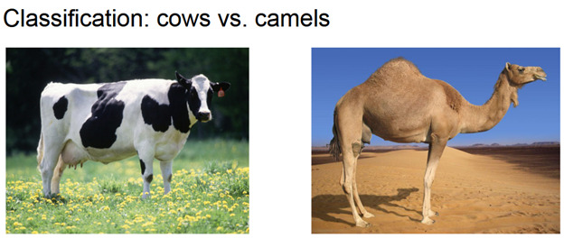
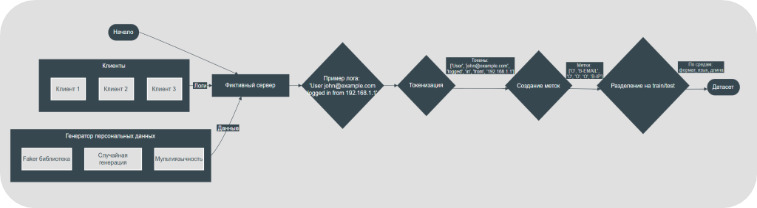
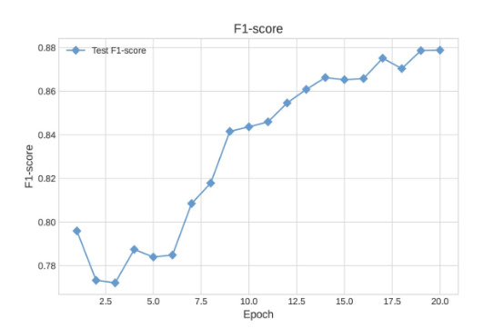
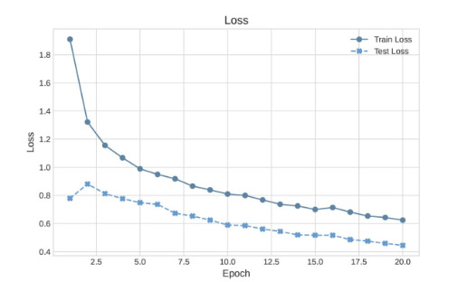
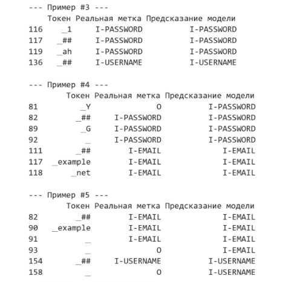

# Устойчивое к сдвигу данных обнаружение PII в логах с помощью Invariant Risk Minimization


Этот репозиторий посвящен исследованию методов робастного обучения для задачи NER (Named Entity Recognition), а именно — для обнаружения Персональных Идентифицируемых Данных (PII) в текстовых логах.

Основная цель проекта — продемонстрировать, как модели, обученные с помощью методов инвариантного обучения (IRM, B-IRM), становятся устойчивыми к **сдвигу распределения данных** и превосходят стандартные подходы на данных, отличающихся от обучающей выборки.

## 📜 Оглавление

- [Проблема: Сдвиг распределения и ложные корреляции](#-проблема-сдвиг-распределения-и-ложные-корреляции)
- [Подход к решению: Инвариантное обучение](#-подход-к-решению-инвариантное-обучение)
  - [Baseline (ERM)](#baseline-erm)
  - [Invariant Risk Minimization (IRM)](#invariant-risk-minimization-irm)
  - [Balanced-IRM (B-IRM)](#balanced-irm-b-irm)
- [Структура репозитория](#-структура-репозитория)
- [Наборы данных](#-наборы-данных)
- [Процесс обучения и результаты](#-процесс-обучения-и-результаты)
- [Как запустить](#-как-запустить)
- [Дальнейшие шаги](#-дальнейшие-шаги)

## 🎯 Проблема: Сдвиг распределения и ложные корреляции

Качество работы больших языковых моделей напрямую зависит от того, насколько данные, на которых они тестируются, похожи на те, что использовались при обучении. Когда эти распределения отличаются, происходит **сдвиг данных**, и производительность модели может резко упасть.

Причина этого в том, что модели часто выучивают **ложные (spurious) корреляции** — зависимости от контекста, а не от самих признаков объекта.

**Пример из другой области:** Модель классификации животных научилась определять верблюдов по песчаному фону, а не по их анатомическим особенностям. На фотографии верблюда в зоопарке такая модель даст сбой.



*(Рис. 1 - Иллюстрация проблемы: модель опирается на фон (среду), а не на инвариантные признаки объекта)*

В нашей задаче (поиск PII в логах) это означает, что модель может научиться определять EMAIL по формату лога (например, `json`) или по ключевому слову (`"user_email": ...`), вместо того чтобы анализировать саму структуру email-адреса. Такая модель будет бесполезна на логах другого формата.

## 💡 Подход к решению: Инвариантное обучение

Чтобы заставить модель находить **инвариантные признаки**, не зависящие от окружения, мы применяем методы робастного обучения. Для этого мы разделяем наши данные на разные **среды** (environments) — например, логи разного формата (JSON, CSV, TXT) — и оптимизируем модель так, чтобы она работала одинаково хорошо в каждой из них.

Мы сравниваем три подхода:

### Baseline (ERM)

Стандартный подход (Empirical Risk Minimization), при котором модель `rubert-tiny2` дообучается на всем смешанном наборе данных. Модель хорошо справляется с данными, похожими на обучающие, но уязвима к сдвигу.

> **Notebook:** `baseline.ipynb`

### Invariant Risk Minimization (IRM)

Метод, который вводит в функцию потерь дополнительный штраф. Этот штраф наказывает модель, если градиенты ошибки для разных сред сильно различаются. Это заставляет модель находить такое представление данных, которое является оптимальным для всех сред одновременно.

Недостаток классического IRM в том, что при обучении моделей с большим числом параметров (как у трансформеров) штраф может быстро обнулиться, и обучение превращается в обычный ERM.

> **Notebook:** `irm_train.ipynb`

### Balanced-IRM (B-IRM)

Улучшенная версия IRM, которая решает проблему затухания штрафа и лучше справляется с большим числом сред. Вместо прямого сравнения градиентов, B-IRM анализирует апостериорные распределения классификаторов для каждой среды, стремясь минимизировать расхождения между ними. Это делает модель более устойчивой к переобучению и позволяет достичь лучшей обобщающей способности.

> **Notebook:** `birm_train.ipynb`

## 📁 Структура репозитория

```
/
├── baseline.ipynb                # Ноутбук с дообучением базовой модели (ERM)
├── irm_train.ipynb               # Ноутбук с дообучением модели по методу IRM
├── birm_train.ipynb              # Ноутбук с дообучением модели по методу B-IRM
├── generated_logs_dataset_format.csv # Датасет с шаблонами логов
└── generated_pii_dataset_structured.csv # Датасет с различными PII сущностями
```

## 📊 Наборы данных

Для обучения и тестирования моделей используются два файла:

- `generated_pii_dataset_structured.csv`: Содержит структурированные PII-сущности различных типов (EMAIL, PHONE, NAME и т.д.).
- `generated_logs_dataset_format.csv`: Содержит шаблоны текстовых логов разных форматов, в которые подставляются PII для генерации обучающих примеров.



*(Рис. 2 - Схема генерации данных и разделения на среды)*

## 🚀 Процесс обучения и результаты

### Baseline (ERM)

Модель показывает высокую общую точность (accuracy), но это связано с дисбалансом классов (большинство токенов — не PII). Более важная метрика, **precision для PII-классов**, составила около **0.82**.

### IRM

Применение стандартного IRM к большой языковой модели привело к переобучению. Штрафующая составляющая функции потерь быстро обратилась в ноль, и модель не смогла выучить инвариантные признаки.

### B-IRM

Метод B-IRM показал наилучшие результаты, превзойдя Baseline по всем ключевым метрикам. Использование адаптивного штрафа и байесовского подхода позволило избежать проблем IRM и добиться значительного улучшения качества на данных из разных сред.



*(Рис. 3 - F1-метрика для PII-классов при обучении B-IRM)*



*(Рис. 4 - Динамика функции потерь при обучении B-IRM)*

Ниже представлен пример работы финальной модели, обученной с помощью B-IRM.



*(Рис. 5 - Сравнение предсказанных меток и реальных)*

## ⚙️ Как запустить

1.  **Клонируйте репозиторий:**
    ```bash
    git clone https://github.com/your-username/your-repo-name.git
    cd your-repo-name
    ```

2.  **Установите зависимости:**
    (Рекомендуется создать виртуальное окружение)
    ```bash
    pip install -r requirements.txt
    ```
    *Примечание: файл `requirements.txt` необходимо создать самостоятельно, если его нет.*

3.  **Запустите Jupyter Notebook:**
    ```bash
    jupyter notebook
    ```

4.  Откройте и выполните один из ноутбуков: `baseline.ipynb`, `irm_train.ipynb` или `birm_train.ipynb`.

## 🔮 Чтобы хотелось бы еще сделать

- Проверить методы, используя другие критерии для разделения на среды (например, по языку персональных данных или по длине логов).
- Реализовать методы робастного обучения, которые не требуют явного разделения данных на среды (например, на основе состязательных сетей).

---
